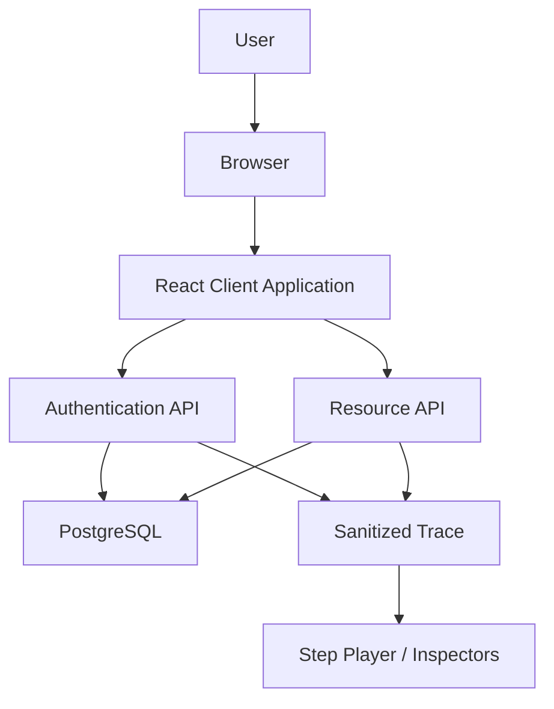
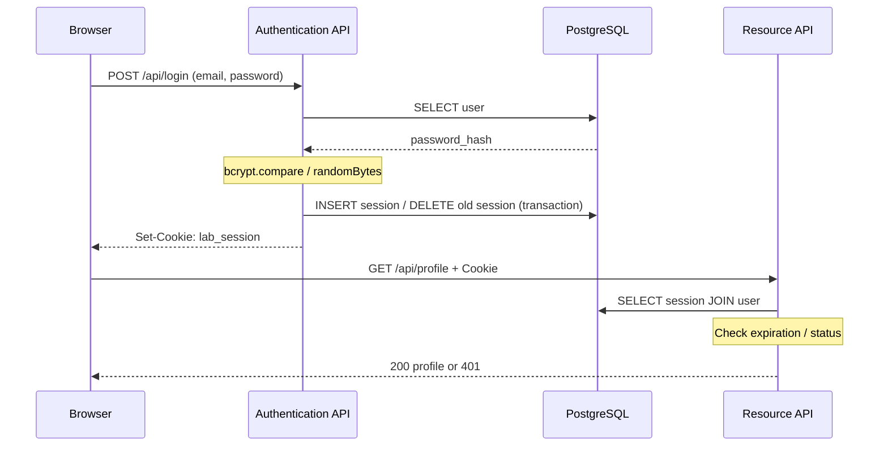

# v1.4 学習画面の情報整理

Sessionの入口を「順番に学ぶ」に変更。従来の詳細画面は「自由に実験する」に残す。

- 学習カードは問い・3つの場所の図・短い説明・1つの主要操作で構成する。
- 操作後も同じ問いに留まり、抜粋した実行ステップを読み、結果を確かめてから次の問いに進む。操作と記録の再生を明確に区別する。
- 保存／削除の結果でのみ簡潔な前後比較を表示。全HTTP、全イベント、完全なIDは折りたたむ。
- 画面には1つの操作の履歴だけを表示。ライブ状態と過去の再生を同じ画面に混在させない。
- 観測と達成判定は既存のguideProgressを利用。状態確認に失敗した場合は達成を付けず再試行。想定する同一Sessionの証拠が揃わなければ再開始を案内する。
- 学習の位置はGuidedTour内、実行したObservation配列はLabに保持。自由実験への切り替えで観測結果を失わない。学習画面に戻ると開始画面に戻り、明示的な開始でSessionと観測を初期化する。
- 次の問いでは見出しにフォーカスし、キーボード・読み上げ利用者にも遷移先を伝える。
- スマートフォンでも3つの場所を横並びに保ち、図の位置関係を変えない。

認証・DB・Docker不要の起動方法は変更なし。PasswordとDatabaseページは既存構成を保持。

---

# v1.3 更新：操作から理解につなげる

- `Observation`は1操作のResultと、直前・直後の`lab/state`で観測した状態を保持する。処理後の確認が失敗した場合はafter=nullで、成功を推定しない。
- ログインはloginのみ。profileは独立操作とし、発行と利用を分けて学ぶ。確認APIのリクエストはプロフィール取得ではない。
- 操作履歴から実行ステップを展開し、単一の再生インデックスを図・ログ・Sequence・DBスナップショットで共有する。前後比較はインデックスが属する操作に追従する。入力検証でステップがない400も個別に見返せる。
- Cookie保存の証拠はSet-Cookie発行だけではなく、次の確認リクエストでの受信とDBの同じ番号。削除も確認リクエストとDBの両方から判定する。
- ガイドは最新の確認済みログインIDを起点に、同じIDでのprofile成功→同じIDのlogout削除→Cookieなしprofile401を順に確認する。401を一律に達成扱いしない。
- 図は記録再生であり、サーバーを一時停止しない。browser-modelイベントはブラウザ動作の説明。現在の状態、選択ステップの記録、操作全体の比較をラベルで区別する。
- 画面内の履歴と自動チェックはリロードでリセット。認証情報をlocalStorageへ保存しない。

# v1.1 更新: Docker不要・PGlite内蔵

# Authentication Learning Lab — 実装前設計

対象: PHASE 1〜6。実行可能なSession認証を優先する。JWT以降のコードは実装せず、拡張方針を記す。

## 1. System Architecture
Next.js App Router / React / TypeScript strict。Node.js Route HandlerがAuthentication ServerとResource Serverの役割を担い、PostgreSQLをusers・sessionsストアに使う。v1.1ではPGliteをNode.js内に組み込み、npm run dev / npm startで起動する。外部DB・Dockerは不要。data/authlabに永続化。異なる責務は同一プロセス内でも画面とコードで区別する。外部IdPはこの段階では存在しない。

## 2. Component Diagram

## 3. Directory Structure
- src/app: ページ、HTTP境界
- src/components: 操作・再生・状態ビュー
- src/lib/auth.ts: パスワード照合とSessionドメイン
- src/lib/store.ts: PostgreSQL永続化、学習空間分離
- src/lib/trace.ts: 教育用イベント定義・記録
- src/lib/http.ts: Cookie・同一Origin検証・レスポンス
- db/schema.sql: 冪等なDDL
- tests: ドメイン・HTTP・ブラウザー検証
- docs/adr: 設計判断

## 4. Database Schema
lab_spaces(id, created_at)が独立した学習空間。users(id, lab_id, email, password_hash, role, status, created_at)とsessions(id, lab_id, user_id, expires_at, created_at)を保持。Session IDはnode:cryptoの32バイト乱数。教材でIDの一致を観察するためSession IDをそのまま保存する。実運用への転用時はハッシュ保存も検討。user_idとlab_idの複合外部キーで別空間を参照できない。未来のrefresh_tokens / oauth_clients / authorization_codesは空の予約スキーマとして準備し、Viewerでは「未実装」と明記。

## 5. Authentication Learning Path
45分目安: Identity/Credential(5) → Password/Salt/bcrypt(8) → Cookie属性(7) → Sessionの生成と照合(15) → 期限切れ/Logout/401/403(10)。完了チェックはこの端末のlocalStorage。認証情報をlocalStorage/sessionStorageへ保存しない。

## 6. Session Authentication Sequence

LogoutはDBのSession削除後Cookie削除。期限切れはサーバー側のexpires_atで判定。教育操作でDB期限を過去にするため「Cookieがあっても無効」を観察できる。通常の有効期限は5分、実験用に15秒も選択可。

## 7. JWT Authentication Sequence（将来）
資格情報検証 → 署名付きJWT発行 → APIへBearer送信 → 固定した許可アルゴリズム・署名・iss/aud/exp検証。JWSは暗号化ではない。Session版のUIとイベント型を共用する。

## 8. Session vs JWT Comparison Design（将来）
本人確認、証明の発行、保存、リクエスト、検証、失効の意味単位で対応付ける。DB照合と署名検証を同じステップ数に無理に合わせない。優劣でなく失効・保存場所・漏えい時の特性を比較する。

## 9. OAuth / OIDC Sequence（将来）
Client → Authorization Endpoint → Login/Consent → code → Token Endpoint(code + verifier) → Access Token。OIDCではscope=openid、ID Token検証（iss/aud/exp/nonce）とUserInfoを追加。実装前にMock IdPを分離する。

## 10. OAuth vs OIDC Comparison Design（将来）
認可委譲と本人確認の目的、tokenの受信者、scope、ID Token、UserInfoを比較する。Access Token単独をClientのログイン証明に使わない。

## 11. 「今どこ？」Visualization Design
User / Browser / Client Application / Authentication Server / Resource API / Databaseを表示。各イベントにwhat, why, engineer, from, to, location, data, protocol, generatedBy, storedBy, timestampを持つ。イベント選択とログ選択を同期する。通常のHTTPリクエストを実行してから記録を再生し、サーバーを停止しているように偽装しない。実行中は操作をロックする。

## 12. Raw Authentication Data Viewer Design
実際のID、bcryptハッシュ、Cookie設定と有効期限を表示。パスワード平文は入力欄以外に出さず、HTTP body/log/traceでは固定文字列[REDACTED]に置換。HttpOnly CookieはJSで読み取れないため、サーバーが受信したCookieを教育用レスポンスで明示する。この例外はlocalhost専用LAB_MODEでのみ有効。

## 13. Screen Structure
/ は18レベルのロードマップ（未対応レベルを明記）。/password と /session は左操作、中央フローとステップ解説、右状態、下部HTTP / Browser / Database / Logs / Rawの共通構造。/database は実DB照会。今回の用語説明はデモ内に収める。未実装機能への空リンクは作らない。

## 14. Implementation Plan
1. 設計、パッケージ、Node.js起動スクリプト、DDL
2. Dashboard、共通レイアウト
3. bcryptによる資格情報照合（Sessionを作らないAPIも用意）
4. Session発行、Profile/Admin、Logout、期限切れ、空間初期化
5. イベントとプレイヤー、初心者/エンジニア説明
6. HTTP/DB/Browser/Raw、現状態と履歴スナップショット
7. 対象範囲のテスト、README、成果物梱包

## 安全境界
教材専用。デフォルト127.0.0.1で公開。LAB_MODE=trueと許可Originを必須化。変更リクエストはOrigin完全一致・JSON content-type・カスタムヘッダーを検証。別OriginへのCORS許可なし。CookieはHttpOnly/SameSite=Lax/Path=/。HTTP localhostのみSecure=falseを明記し、HTTPS時はtrue。空間識別用Cookieと認証Cookieを分離。本人確認の成否を空間Cookieで判定しない。実ユーザー登録や外部秘密情報入力は想定しない。

## 参照
- https://nextjs.org/docs/app/api-reference/functions/cookies
- https://cheatsheetseries.owasp.org/cheatsheets/Session_Management_Cheat_Sheet.html
- https://cheatsheetseries.owasp.org/cheatsheets/Password_Storage_Cheat_Sheet.html
